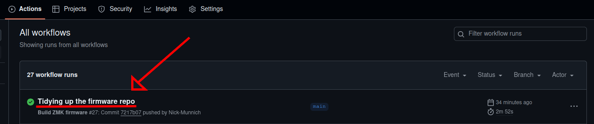
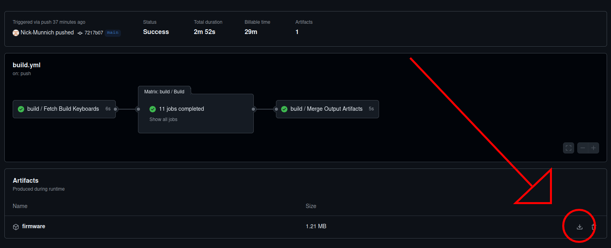
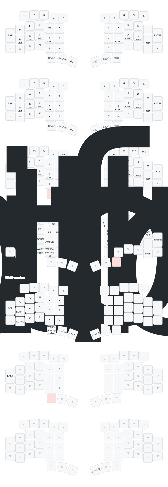

# Apiaster Keyboard Firmware Module

This repo contains the firmware files for the [Apiaster](https://github.com/Nick-Munnich/apiaster) keyboard.


Firmware using the XIAO nRF52840 makes use of the awesome [RGBLED widget module](https://github.com/caksoylar/zmk-rgbled-widget).

# Getting Your Firmware

**Do not fork this repository**. You have two options: You can download the firmware from this repository directly, or you can use a ZMK config repository to customise the keymap and other settings before downloading. Firmware from this repository optionally has [ZMK Studio](https://zmk.dev/docs/features/studio) enabled for basic keymap customisation.

## GitHub Actions Download

You can download your firmware from this repo's most recent [GitHub Actions](https://github.com/Nick-Munnich/zmk-apiaster-module/actions).

|  | 
|:--:| 
| *Click on the successful workflow action* |

|  | 
|:--:| 
| *Download the firmware by clicking here or on the firmware text* |

The `.zip` file will contain the following firmware files, from which you should choose the one(s) that (is/are) appropriate:

|Name |Notes|
|:---:|:---:|
|`apiaster-left-xiao-ble-logging.uf2` |  XIAO nRF52840 left side with [usb logging](https://zmk.dev/docs/development/usb-logging) enabled for debugging purposes.  |
|`apiaster-left-xiao-ble-studio.uf2` |  XIAO nRF52840 left side with [ZMK Studio](https://zmk.dev/docs/config/studio) enabled, allowing you to customise your keymap in real time.          |
|`apiaster-left-xiao-ble.uf2` |  XIAO nRF52840 basic left side.          |
|`apiaster-right-xiao-ble-logging.uf2` |  XIAO nRF52840 right side with [usb logging](https://zmk.dev/docs/development/usb-logging) enabled for debugging purposes.          |
|`apiaster-right-xiao-ble.uf2` |   XIAO nRF52840 basic right side.          |
|`apiaster-rp2040-zero-studio.uf2` |   RP2040-Zero with a USB-A 3.0 cable connecting the halves. Has [ZMK Studio](https://zmk.dev/docs/config/studio) enabled, allowing you to customise your keymap in real time.          |
|`apiaster-rp2040-zero.uf2` |  RP2040-Zero with a USB-A 3.0 cable connecting the halves.          |
|`apiaster-rp2040-logging.uf2` |RP2040-Zero with a USB-A 3.0 cable connecting the halves.  Has [usb logging](https://zmk.dev/docs/development/usb-logging) enabled for debugging purposes. | 
|`apiaster-xiao-ble-studio.uf2` |  XIAO nRF52840 with a USB-A 3.0 cable connecting the halves. Has [ZMK Studio](https://zmk.dev/docs/config/studio) enabled, allowing you to customise your keymap in real time.           |
|`apiaster-xiao-ble.uf2` |  XIAO nRF52840 with a USB-A 3.0 cable connecting the halves.          |
|`apiaster-dongle-xiao-ble.uf2` |  XIAO nRF52840 dongle for use with apiaster.          |
|`apiaster-dongle-xiao-ble-studio.uf2` |XIAO nRF52840 dongle for use with apiaster. Has [ZMK Studio](https://zmk.dev/docs/config/studio) enabled, allowing you to customise your keymap in real time.|
|`apiaster-dongle-xiao-ble-logging.uf2` |XIAO nRF52840 dongle for use with apiaster. Has [usb logging](https://zmk.dev/docs/development/usb-logging) enabled for debugging purposes.|
|`apiaster-left-xiao-ble-with-dongle.uf2` |XIAO nRF52840 left half, configured for usage with a dongle. |
|`rp2040-zero-reset.uf2` |  [Reset firmware](https://zmk.dev/docs/troubleshooting/connection-issues#building-a-reset-firmware) for the RP2040-Zero, to reset the MCU back to default (e.g. resetting Studio keymaps).          |
|`xiao-ble-reset.uf2` |  [Reset firmware](https://zmk.dev/docs/troubleshooting/connection-issues#building-a-reset-firmware) for the XIAO nRF52840, to reset the MCU back to default (e.g. resetting all Bluetooth connections).           |

Note that only the [central](https://zmk.dev/docs/features/split-keyboards#central-and-peripheral-roles) (i.e. the left half or dongle) needs to have Studio enabled.

## Customising Keymap Details

If you want to customise your keymap with advanced features without the use of [ZMK Studio](https://zmk.dev/docs/features/studio), then you will need to use your own ZMK config repo.

### I do not have a ZMK config repo yet

Go to [this page](https://zmk.dev/docs/user-setup-cli) to set up the ZMK command line interface. Install it and initialise a repository, then follow the steps in the next section.

### I already have a ZMK config repo

#### Adding this repo as a module

Navigate to the `config/west.yml` file. It should look something like this:

```yaml
manifest:
  remotes:
    - name: zmkfirmware
      url-base: https://github.com/zmkfirmware
    # Additional modules containing boards/shields/custom code can be listed here as well
    # See https://docs.zephyrproject.org/3.2.0/develop/west/manifest.html#projects
  projects:
    - name: zmk
      remote: zmkfirmware
      revision: main
      import: app/west.yml
  self:
    path: config
```

Add this repository as a module, making sure to import `config/west.yml` from this repo.

```yaml
manifest:
  remotes:
    - name: zmkfirmware
      url-base: https://github.com/zmkfirmware
    # Additional modules containing boards/shields/custom code can be listed here as well
    # See https://docs.zephyrproject.org/3.2.0/develop/west/manifest.html#projects
    - name: munnich
      url-base: https://github.com/Nick-Munnich
  projects:
    - name: zmk
      remote: zmkfirmware
      revision: main
      import: app/west.yml
    - name: zmk-apiaster-module
      remote: munnich
      revision: main
      import: config/west.yml
  self:
    path: config
```

#### Copying files to edit

Copy the following file from this repo into your `config` folder:

- `boards/shields/apiaster/apiaster.keymap` -> `config/apiaster.keymap`
- `boards/shields/apiaster/apiaster.conf.template` -> `config/apiaster.conf`

Note that you should get rid of the `.template` from the name. This file's settings will be shared between all parts of the keyboard. If you wish to change Kconfig settings for individual parts, delete the general `apiaster.conf` and replace it with individually named `apiaster_left.conf`, `apiaster_right.conf`, ...

#### Selecting what to build firmware for

Finally, you can edit your `build.yaml` to build firmware for this keyboard. Use this repo as a reference for syntax. For example, you might end up with this:

```yaml
---
include:
  - board: rp2040_zero
    shield: apiaster_wired
    snippet: studio-rpc-usb-uart
    cmake-args: -DCONFIG_ZMK_STUDIO=y
```

# Default Keymap

The default keymap provided can be found below. I recommend [Graphite](https://github.com/rdavison/graphite-layout) as an alternative keyboard layout, but QWERTY is also included if you do not wish to switch to an alternative layout. Your modifier keys (shift, alt, ctrl, win/cmd/gui) are located on your home row as hold keys. For example, you can hold the key marked as `A/RSHFT` with your right middle finger and then tap the key marked with `S/LCTRL` with your left index finger to type a capital `S`.

You can read more about home row mods [here](https://precondition.github.io/home-row-mods). The specific implementation of home row mods used is known as [timeless home row mods](https://github.com/urob/zmk-config?tab=readme-ov-file#timeless-homerow-mods). If you're not a fan of home row modifiers and wish to move them, do so! Remember, your keymap is infinitely customisable. I recommend using thumb keys and the outermost pinky keys for modifiers if you do not wish to use home row mods.


